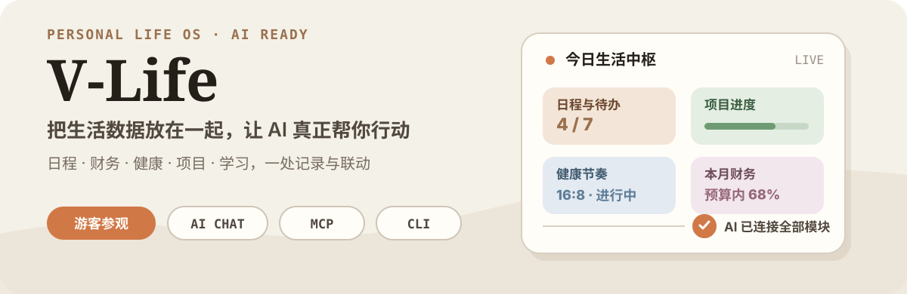
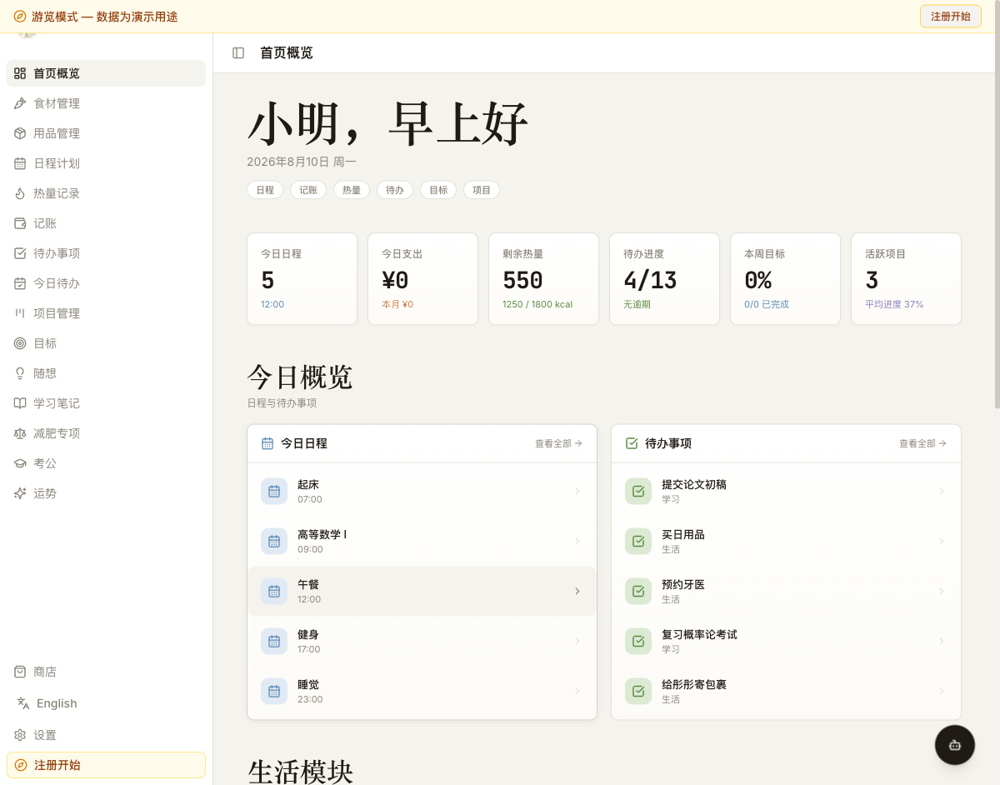
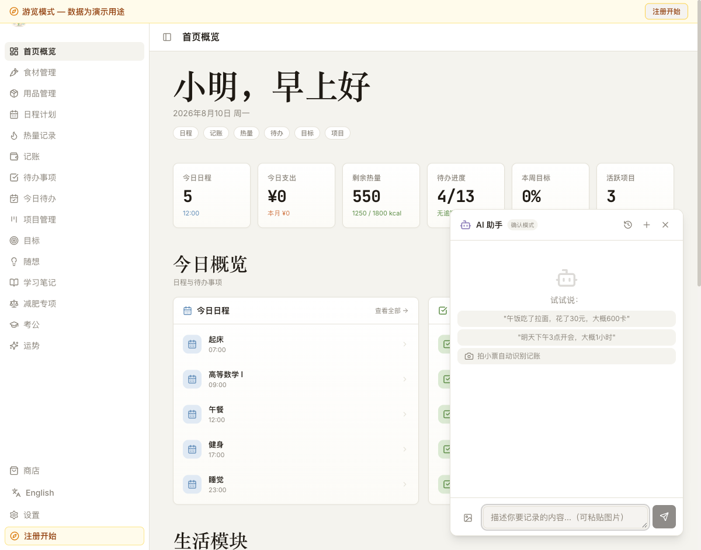
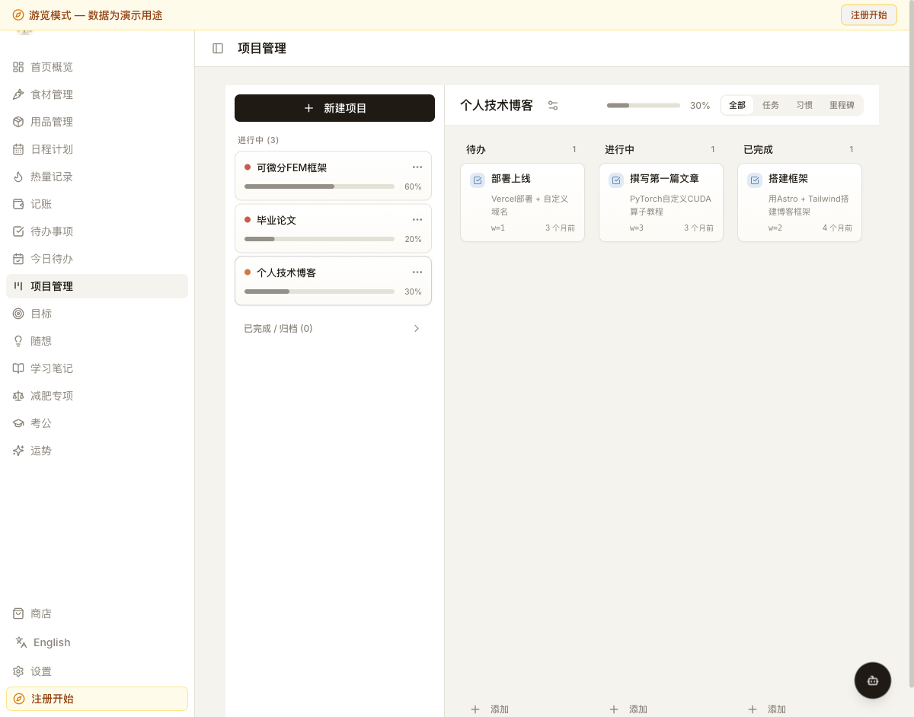

<p align="center">
  
</p>

<p align="center">
  <a href="#-快速体验">快速体验</a> ·
  <a href="#-生活数据一处联动">功能地图</a> ·
  <a href="#-让-ai-读写你的生活数据">AI 接入</a> ·
  <a href="#-本地部署">本地部署</a>
</p>

<p align="center">
  
  
  
  
</p>

V-Life 是一个 AI 辅助的个人生活管理 Web 应用。它把原本散落在不同工具里的日程、财务、健康、项目、学习与灵感整理成结构化数据，再通过内置对话、MCP Server 和 CLI 交给 AI 查询与更新。

> 从“记下生活”到“让生活数据参与决策”：同一份上下文，同一个首页，同一套可读写接口。

## 👀 先看真实界面

<p align="center">
  
</p>

<p align="center">
  
  
</p>

以上截图来自仓库当前版本的本地 Guest Tour，不依赖真实个人数据。

## ✨ 为什么是 V-Life

- **一个首页看全局**：把当天日程、任务、项目、学习、财务与健康状态压缩成可行动的概览。
- **模块之间共享上下文**：日程、待办、目标、项目和生活记录不是信息孤岛，AI 可以跨模块理解。
- **先参观，再配置**：Guest Tour 内置完整示例数据，无需 Supabase 账号即可浏览主要流程。
- **不只是在网页里使用 AI**：内置对话、Supabase MCP Server 与 Node.js CLI 共用结构化数据。
- **适合长期自托管**：Supabase 提供 Postgres、Auth、RLS 与 Edge Functions，数据边界由你控制。

## 🧭 生活数据一处联动

| 场景 | 能力 |
| --- | --- |
| **今天** | 首页概览、今日日程、待办与积分商店 |
| **组织** | 项目看板、周期目标、灵感随想、学习笔记 |
| **生活** | 食材保质期、用品成本、热量、体重与围度、16:8 进食窗口 |
| **财务** | CNY / JPY 记账、汇率换算、月度预算与分类统计 |
| **备考** | 考试倒计时、计划、打卡、错题与行测套题 |
| **探索** | 塔罗、星座、生肖、周易、抽签、八字与历史记录 |

侧栏当前包含 15 个主要入口，另有商店和设置；页面按路由懒加载。你也可以在设置中隐藏不需要的模块，或切换到考公专注模式。

## 🚀 快速体验

只想先看看产品时，不需要创建 Supabase 项目：

```bash
git clone https://github.com/EricLeeK/v-life.git
cd v-life
npm install
npm run dev
```

打开 `http://localhost:8080`，在登录页点击 **游客参观 / Guest Tour**。示例数据保存在浏览器内存中，不会写入后端。

## 🤖 让 AI 读写你的生活数据

V-Life 提供三条入口，适合不同使用方式。

### 1. 内置 AI 对话

右下角对话面板支持 OpenAI 兼容接口，可配置 Gemini、GPT、Claude 或自定义 Endpoint。它提供确认执行、直接执行和仅对话三种模式，并通过结构化 `actions` 完成 CRUD。

### 2. Supabase MCP Server

部署 `supabase/functions/mcp-server` 后，可让支持远程 MCP 的客户端访问 V-Life：

```json
{
  "mcpServers": {
    "vlife": {
      "url": "https://<project-ref>.supabase.co/functions/v1/mcp-server"
    }
  }
}
```

Server 暴露各生活模块的 CRUD Tools，以及 Dashboard、Finance、Calories 等统计 Resources。

### 3. V-Life CLI

Node.js 18+ 可直接通过 Supabase REST API 操作或备份数据：

```bash
export VLIFE_SUPABASE_URL="https://<project-ref>.supabase.co"
export VLIFE_SUPABASE_KEY="<service-role-key>"

node cli/vlife.mjs dashboard summary
node cli/vlife.mjs finance create --name="午饭" --amount=850 --currency=JPY --category="餐饮"
node cli/vlife.mjs data export --output=./backup.json
```

完整参数见 [`cli/README.md`](./cli/README.md)。`service-role key` 只能放在可信环境中，不能暴露到前端。

## 🛠️ 本地部署

### 1. 配置环境变量

复制 `.env.example`（如仓库版本提供）或创建 `.env.local`：

```bash
VITE_SUPABASE_URL="https://<project-ref>.supabase.co"
VITE_SUPABASE_PUBLISHABLE_KEY="<anon-key>"
VITE_SUPABASE_PROJECT_ID="<project-ref>"
```

前端只使用受 RLS 保护的 `anon key`。

### 2. 初始化数据库

```bash
supabase link --project-ref <project-ref>
supabase db push
```

迁移文件位于 `supabase/migrations/`，包含核心生活数据、项目、学习、备考、商店、运势与 AI 用量等表及其权限策略。

### 3. 启动与检查

```bash
npm run dev       # http://localhost:8080
npm run build     # 生产构建
npm run test      # Vitest
npm run lint      # ESLint
```

## 🧱 技术结构

| 层 | 主要技术 |
| --- | --- |
| 前端 | React 18、TypeScript 5、Vite 5、React Router 6 |
| UI | Tailwind CSS 3、shadcn/ui、Radix UI、Recharts |
| 状态与校验 | TanStack Query、React Hook Form、Zod |
| 后端 | Supabase Postgres、Auth、RLS、Edge Functions |
| AI | OpenAI 兼容接口、MCP Server、Node.js CLI |
| 质量 | Vitest、Testing Library、Playwright |

```text
v-life/
├── src/
│   ├── pages/             # 生活、项目、学习、备考与运势页面
│   ├── components/        # 布局、业务组件与 shadcn/ui
│   ├── contexts/          # 登录、语言与 Guest Tour
│   ├── hooks/             # Supabase 查询与 mutation
│   └── data/demoSeed.ts   # 游客模式示例数据
├── supabase/
│   ├── migrations/        # 数据表、索引与 RLS
│   └── functions/         # AI Chat、MCP 与自动备份
├── cli/                   # vlife.mjs 命令行客户端
└── tests/e2e/             # Playwright 场景
```

## 🤝 参与开发

Issue 和 PR 都欢迎。建议从小而清晰的改动开始，并在提交前运行：

```bash
npm run lint
npm run test
npm run build
```

## 📄 License

当前仓库尚未包含可识别的开源许可证文件。在许可证明确前，默认保留所有权利；如计划复用或分发代码，请先联系仓库维护者。
