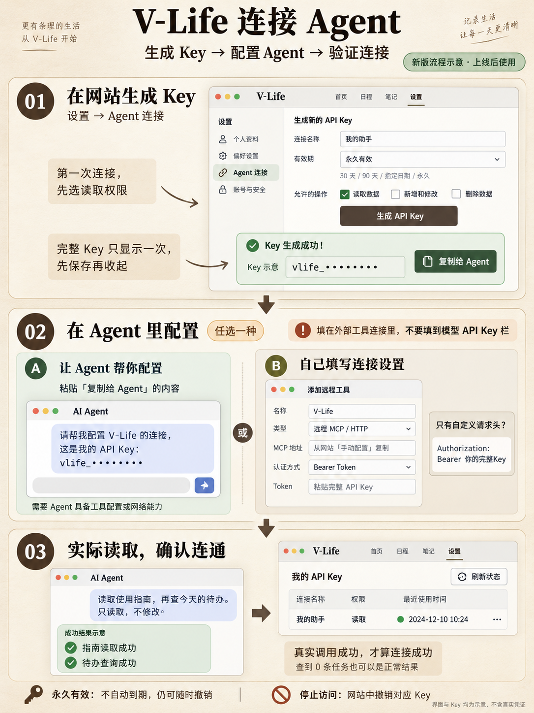

# V-Life Agent 连接新手教程

适用于第一次使用 V-Life、第一次连接 Agent 的用户，无需编程。教程对应新的 API Key 连接方式。

**版本状态：2026 年 10 月 5 日已完成正式后端部署，生成、连接、到期和撤销均已通过线上验证。可以直接按下面的步骤使用；若页面仍保留此前的报错，刷新页面后重试。**



图中的界面与 Key 均为示意，不包含真实凭证。[查看图片生成提示词](assets/agent-connection/connection-guide.prompt.txt)。

## 先认识三个名称

V-Life 是保存你的待办、日程、账单等生活记录的网站。Agent 是能调用外部工具、帮你处理这些记录的 AI 助手。

API Key 可以理解为你发给某个助手的一把专用钥匙。你决定它能读取、修改还是删除，以及什么时候失效。它和网站登录密码、购买 AI 模型服务时使用的 API Key 是不同的。

MCP 是让助手使用网站工具的一种连接方式。你只需找到客户端的对应设置、填写地址和钥匙，不需要学习协议或写代码。

完整流程是：网站生成 Key → 在 Agent 中配置 → 实际读取一次确认连接。

## 在网站生成 Key

1. 登录 [V-Life](https://shenghuo.homes)，打开“设置”，进入“Agent 连接”。如果正在演示模式，先点击“退出演示，管理连接”；演示模式不会创建真实 Key。
2. 填写“连接名称”。这个名称方便你日后识别，例如“我的 Hermes”“工作电脑助手”。名称不影响连接。
3. 选择有效期。第一次试用可选默认的“30 天”；长期自用可以选“永久有效”。
4. 选择权限。第一次连接保留默认的“读取数据”，完成测试后再根据需要创建具有其他权限的 Key。
5. 点击“生成 API Key”。成功后出现以 `vlife_` 开头的一长串字符，并显示复制按钮。

| 有效期 | 含义 |
| --- | --- |
| 30 天 / 90 天 | 从生成时开始计算，到期自动停止访问 |
| 指定日期 | 所选日期当天仍有效，次日北京时间 00:00 失效。例如选 10 月 31 日，11 月 1 日 00:00 失效 |
| 永久有效 | 不自动到期，你仍然可以随时撤销 |

| 权限 | Agent 可以做什么 | 示例 |
| --- | --- | --- |
| 读取数据 | 查看开放给 Agent 的生活记录 | 看今天的待办、查询账单 |
| 新增和修改 | 创建记录或修改支持修改的记录 | 添加待办、记一笔账、完成任务 |
| 删除数据 | 删除支持删除的记录 | 删除你指定的一条记录 |

这些是按操作类型划分的权限，作用于 Agent 已开放的模块，当前没有“只允许看待办、不允许看账单”的单独选项。日常读写通常选“读取数据＋新增和修改”；需要删除时再开放删除。将任务从一天移到另一天，会移除旧安排，因此也需要删除权限。

完整 Key 只在生成后显示一次。先完成配置或保存到自己的密码管理器，再点“我已保存，收起 Key”。之后列表里只会显示前面几个字符，不能用这个缩略前缀接入。不要把完整 Key 放到公开截图、公开聊天或代码仓库里。

## 选择一种接入方法

### 方法一 让能够配置连接的 Agent 帮忙

生成 Key 后，点击“复制给 Agent”。网站会把连接地址、完整 Key 和连接说明一起复制。

把这段内容交给你信任、且具备本地配置或网络工具能力的 Agent。优先使用客户端提供的密钥输入框；如果选择粘贴到对话，完整 Key 会进入该对话记录。

再补充这段话：

> 请按上述信息连接我的 V-Life，使用 API Key 认证。先只测试连接，不修改或删除数据。接入后读取 V-Life 使用指南，告诉我当前有哪些权限，再查询今天的待办。如果你不能配置连接或不能调用外部工具，请明确告诉我需要在哪个设置里操作；不要仅凭收到 Key 就说已经连上。

如果 Agent 成功执行了读取，可以直接跳到“确认连接成功”。如果它说需要你手动添加工具，使用下面的方法二。普通聊天窗口可能只有文字能力，单独收到 Key 无法自动获得外部工具。

### 方法二 自己在 Agent 客户端填写

打开你使用的 Agent 软件，找到添加远程 MCP 服务或外部工具的入口。具体入口名称由客户端决定；本教程不假定某个产品的固定菜单。

| 配置项 | 填写内容 |
| --- | --- |
| 连接名称 | `V-Life`，或你容易识别的名称 |
| 连接类型 | 远程 MCP / HTTP；若区分传输方式，选择 Streamable HTTP |
| 服务地址 / URL | 使用下方完整 MCP 地址，或网站“手动配置 · 连接地址”中的“MCP 地址” |
| 认证方式 | 客户端支持的 Bearer Token，或自定义 Authorization 请求头 |

MCP 地址：

```text
https://veabdivlfhctseihypzl.supabase.co/functions/v1/mcp-server/mcp
```

如果客户端提供 **Bearer Token** 输入框，粘贴网站生成的完整 `vlife_…` Key。客户端通常负责添加 `Bearer` 前缀，以其字段说明为准。

如果客户端提供 **自定义请求头 / Headers**，添加这一项：

| 请求头名称 | 请求头值 |
| --- | --- |
| `Authorization` | `Bearer 你的完整APIKey` |

`Bearer` 和 Key 中间保留一个英文空格，整个值中只出现一次 `Bearer`。上面的中文是占位说明，需要替换为你实际生成的完整 Key。

如果客户端提供 **MCP JSON 配置导入**，可以使用网站的“复制 MCP 配置”。不同客户端的配置结构可能不同，以其支持的导入格式为准；不会编辑配置文件时，优先用可填写地址和请求头的界面。

保存连接并启用它。若客户端提示重载工具或重启会话，按提示操作，再进行连接测试。

V-Life Key 应填入这条外部工具连接的认证设置。模型供应商的 API Key 栏位是给模型服务用的，不适用于 V-Life。服务地址也必须包含上述完整路径，不能只填网站首页。

### 没有 MCP 入口但能发送 HTTP 请求

把网站“复制给 Agent”中的 API 地址和认证信息交给 Agent，让它采用 HTTP API。首次只读取使用指南：

```text
GET https://veabdivlfhctseihypzl.supabase.co/functions/v1/agent-api/api/v1/guide
Authorization: Bearer 你的完整APIKey
```

这是给有 HTTP 工具能力的 Agent 的说明，不需要小白用户在终端执行。直接在浏览器地址栏打开地址不会自动带上 Key，出现未授权提示不等于 Key 无效。

如果客户端只支持 OAuth，使用网站“其他连接方式 · OAuth”及客户端自己的授权流程。API Key 接入本身无需填写回调地址；不要将 V-Life 的 `/oauth/consent` 填成 Agent 回调。

## 确认连接成功

给 Agent 发一句：

> 请实际调用 V-Life 的使用指南，告诉我当前允许读取、修改和删除中的哪些操作。然后查询今天的待办，只读取，不做修改。若调用失败，请说明错误，不要把读取失败说成没有任务。

Agent 需要真正调用工具：MCP 使用 `agent_help`，HTTP 使用 `GET /guide`。指南成功后，再读取今天的待办。成功返回零条也是有效结果；接口报错则是连接或调用失败。

回到 V-Life 的“我的 API Key”，点击“刷新状态”，查看对应连接是否出现最近使用时间。**真实读取结果是主要依据，最近使用时间是辅助依据；Agent 只说“我记住了”“已经配置好了”还不算连接验证。**

## 连上后怎么说

你继续用日常语言提要求，不需要写工具名。

| 你可以说 | 需要的权限 |
| --- | --- |
| “看看今天有哪些任务，还剩哪些没完成。” | 读取 |
| “汇总我本月的账单，按类别列出来。” | 读取 |
| “把买牛奶加入今天的待办。” | 读取＋新增和修改 |
| “午餐花了 28 元，帮我记账。” | 读取＋新增和修改 |
| “将今天的买牛奶任务标记为完成。” | 读取＋新增和修改 |
| “把昨天未完成的任务移到今天。” | 读取＋新增和修改＋删除 |

第一次使用写入时，可以明确添加一句“先列出准备修改的内容，等我确认后再写入”。执行后去网站查看相应记录。

## 以后怎样管理

关闭网站、退出登录不会自动撤销 Key。Agent 是否在新会话中保留连接，取决于客户端是否把配置保存好了；“永久有效”指钥匙不自动到期，不代表所有聊天窗口都会自动记住它。

每个 Agent 或设备分别生成一个 Key，例如“笔记本助手”和“家里电脑助手”。停用一个时，只撤销对应的 Key，其他连接可以继续使用。

忘记或没保存完整 Key：生成新的 Key，在 Agent 中替换并验证，再撤销旧 Key。需要更改有效期或权限时，目前也是创建新 Key，再替换旧配置。仅想暂停该助手访问，则在网站点击对应 Key 的“撤销”；以后恢复连接需要新 Key。

如果怀疑 Key 发错地方，先撤销旧 Key，再创建新的。撤销不会删除已经存在的待办或账单，也不会收回 Agent 之前已经读取并保存的内容。

## 遇到问题时

| 现象 | 怎么处理 |
| --- | --- |
| 网站没有“生成 API Key” | 确认新版已上线，且已登录、已退出演示模式 |
| 生成时没有收到结果 | 先刷新列表；若出现新 Key 却没拿到完整内容，撤销那把 Key 后再生成 |
| Agent 说没有外部工具能力 | 在客户端添加 MCP 连接，或使用具备 HTTP 工具的 Agent；仅粘贴文字不能增加工具能力 |
| 提示 Key 无效 / 已过期 / 已撤销，或错误码 `API_KEY_INVALID` | 核对是否用了完整 Key、有效期、撤销状态，以及 Bearer 是否重复；不能仅凭所有 401 都认定过期 |
| 能查询，但不能记账或修改，或提示 `PERMISSION_DENIED` | 当前 Key 权限不足；创建具有所需权限的新 Key，并替换客户端配置 |
| 再次要求 OAuth 回调地址 | 检查客户端是否仍选择了 OAuth；改用 Bearer / 自定义请求头。只支持 OAuth 的客户端继续用其授权流程 |
| 提示服务尚未配置，或 `API_KEY_AUTH_NOT_CONFIGURED` | 联系网站维护者，重复生成 Key 无法解决服务配置问题 |
| 提示服务暂不可用，或 `AUTH_SERVICE_UNAVAILABLE` | 稍后使用同一把 Key 重试；写入超时后先核对网站结果，避免重复记账或创建任务 |
| 列表刷新失败 | 页面保留旧内容并提示错误，不能据此断定连接被删除；恢复网络后重新刷新 |

寻求帮助时，提供客户端名称、操作步骤、错误文字及已遮住 Key 的截图即可。不要把完整 Key 放进故障截图。

## 给网站维护者

普通用户无需配置服务端。新版功能启用前，维护者需要完成数据库迁移、服务端签名配置、两个接口发布及真实 Key 验证，再发布网站入口。具体步骤见 [API Key 重构交付记录](agent-api-keys-2026-10-05.md)。本教程没有执行部署，也没有证明某个具体第三方客户端已经连接成功。
